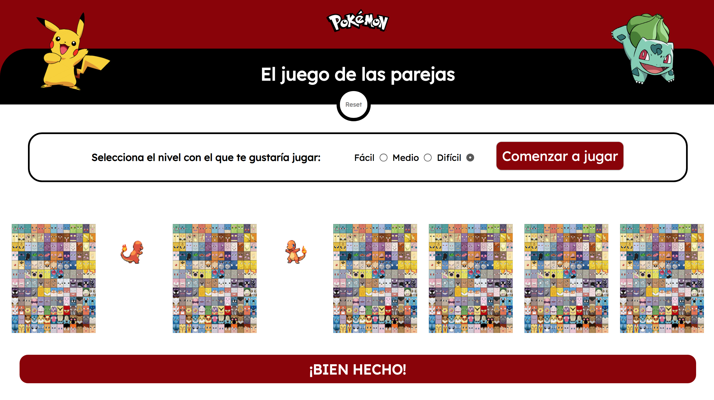

# El juego de las parejas

¿Quién no ha jugado nunca al memory cards? En esta ocasión, se ha desarrollado un pequeño ejemplo de ello con personajes de Pokémon.

## Mecánica del juego

Antes que nada debes elegir el nivel en que quieres jugar:
-Fácil: 4 cartas (2 parejas)
-Medio: 6 cartas (3 parejas)
-Difícil: 8 cartas (4 parejas)

Al hacer click en 'COMENZAR' verás aparecer boca abajo el número de cartas seleccionado.

## Espera, ¿esto se hace siempre?

Sólo la primera vez que lo selecciones. El juego almacena tu elección en localStorage para que al recargar la página puedas volver a jugar en el nivel que escogiste.

## Vamos a jugar

Tenemos las cartas boca abajo. Para empezar a jugar debemos hacer click sobre la carta que queremos desvelar. Al hacer click la carta mostrará su cara frontal, con un personaje. Ahora vamos a buscar su pareja.

Haz click sobre otra carta. Si es su pareja ambas quedarán boca arriba. Si no se mostrarán durante un par de segundos y se darán la vuelta.

(\_src/assets/images/memory-game.png)
